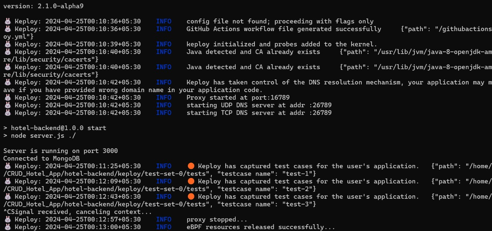
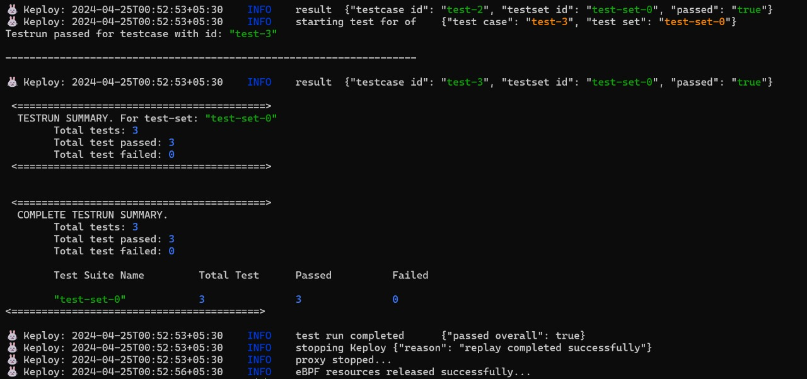

#   Hotel Management Web App
1. **Node.js (version 14 or later):** Download and install it from [https://nodejs.org/en](https://nodejs.org/en).
2. **npm (version 5.6 or later):** This usually comes bundled with Node.js. Verify by running `npm -v` in your terminal.

**1. Clone the Repository and Install Dependencies:**

```bash
git clone https://github.com/keploy/samples-typescript && cd samples-typescript/express-mongo_Rohit_yadav
npm install
```

**2. Run the Development Server:**
Run the following command to launch the development server:

```Bash
npm run dev
```
# Different  Jest Api Test cases

##   Test Case 1: Book a Room

```javascript

test('View Bookings - Success', async () => {
  const response = await axios.get('http://localhost:3000/bookings/view', {
    headers: {
      'Content-Type': 'application/json'
    },
    params: {
      roomNumber: "1",
      roomType: "A",
      startTime: "2024-03-07T00:00:00Z", // Adjust startTime and endTime if necessary
      endTime: "2024-03-08T00:00:00Z"
    }
  });

  expect(response.status).toBe(200);
  expect(response.data.bookings.lenQgth).toBeGreaterThan(0); // Adjusted expectation
});


```

##   Test Case 2: Edit a Booking

```bash
test('Edit a Booking - Success', async () => {
  const requestBody = {
    userEmail: "new_email@example.com",
    roomNumber: "101",
    startTime: "2024-04-23T09:00:00Z",
    endTime: "2024-04-23T11:00:00Z"
  };

  const response = await axios.put('http://your-api-url/edit/<booking_id>', requestBody, {
    headers: {
      'Content-Type': 'application/json'
    }
  });

  expect(response.status).toBe(200);
  expect(response.data.message).toEqual("Booking updated successfully");
});

```

##  Test Case 3: Cancel a Booking

```bash
test('Cancel a Booking - Success', async () => {
  const response = await axios.delete('http://your-api-url/cancel/<booking_id>', {
    headers: {
      'Content-Type': 'application/json'
    }
  });

  expect(response.status).toBe(200);
  expect(response.data.message).toEqual("Booking cancelled successfully");
});

```
##  Test Case 4: View Bookings


```bash
test('View Bookings - Success', async () => {
  const response = await axios.get('http://your-api-url/view', {
    headers: {
      'Content-Type': 'application/json'
    },
    params: {
      roomNumber: "101",
      roomType: "single",
      startTime: "2024-04-23T00:00:00Z",
      endTime: "2024-04-24T00:00:00Z"
    }
  });

  expect(response.status).toBe(200);
  expect(response.data.bookings.length).toBeGreaterThan(0); // Assuming there are bookings for the specified criteria
});

```

# How to run above Test Cases with keploy
 
#### Windows Subsystem for Linux (WSL)

On Windows, WSL is required to run Keploy Binary. 

```bash
wsl --install
```
Once installed download and Install "Keploy Binary" :

```bash
curl --silent --location "https://github.com/keploy/keploy/releases/latest/download/keploy_linux_amd64.tar.gz" | tar xz -C /tmp

sudo mkdir -p /usr/local/bin && sudo mv /tmp/keploy /usr/local/bin && keploy
```

### Let's start the MongoDB Instance
```zsh
docker-compose up -d
```

> **Since we have setup our sample-app natively, we need to update the mongoDB host on line 41, in `db/connection.js`, from `mongodb://mongoDb:27017/Students` to `mongodb://127.0.0.1:27017/keploy`.**

### Capture the testcases

```bash
sudo -E env PATH=$PATH keploy record -c 'node src/app.js'
```


## we will get the output:


## Running the testcases


```bash
keploy test -c "CMD_TO_RUN_APP" --delay 10


```



